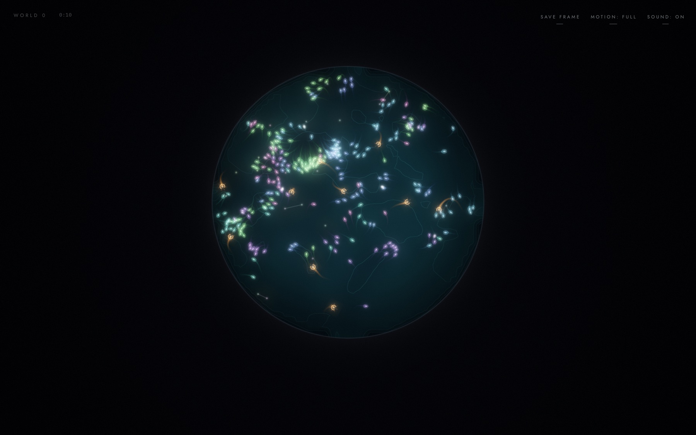
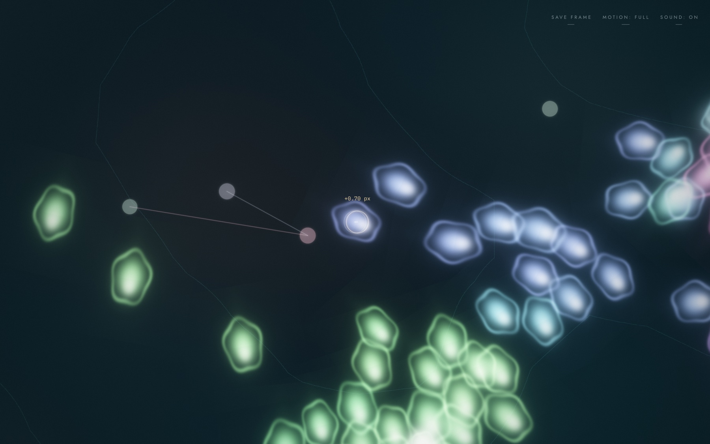
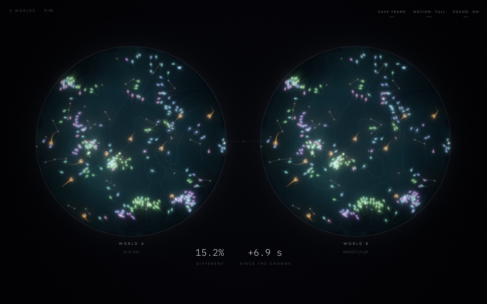
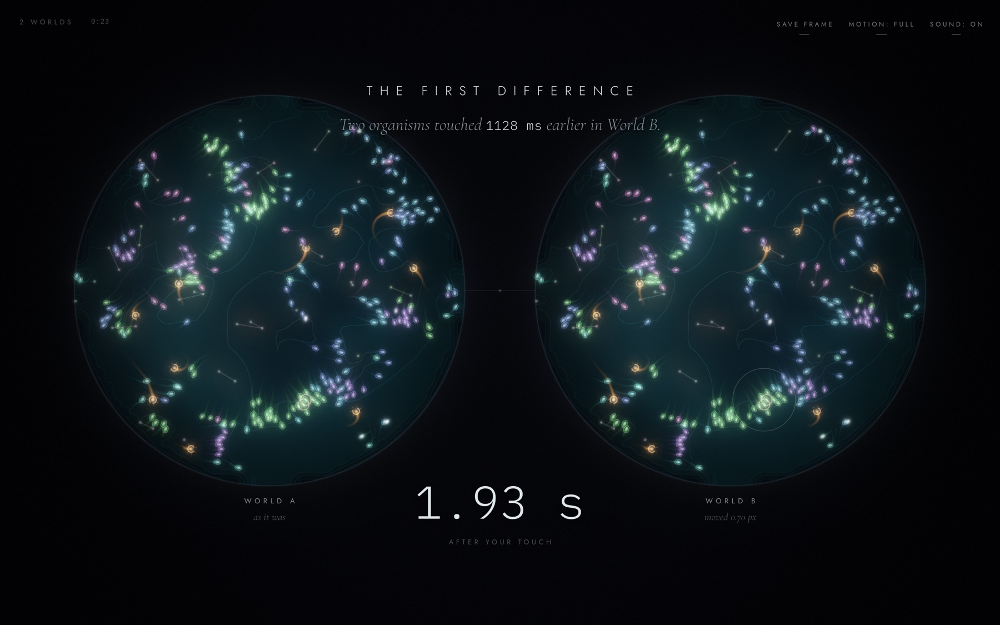
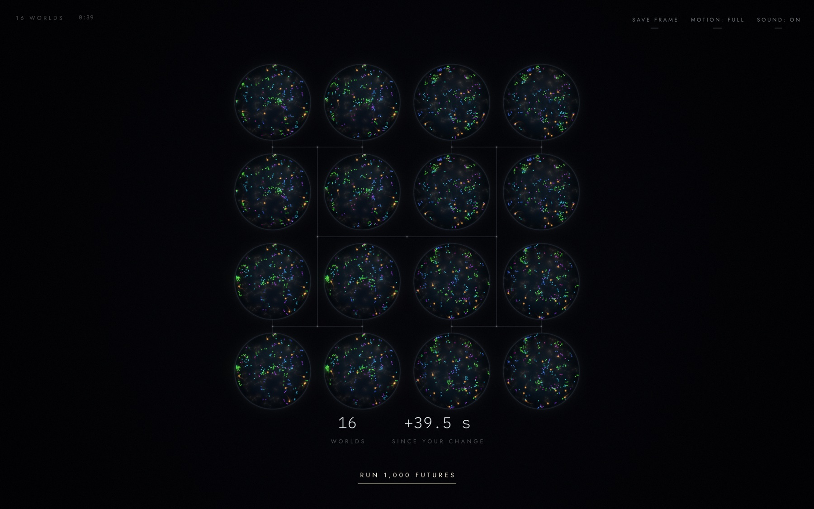
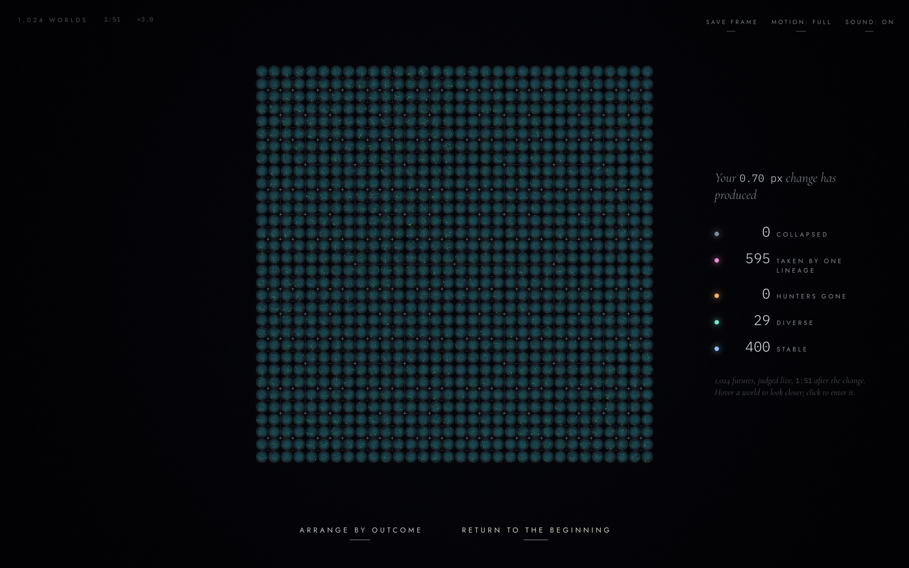
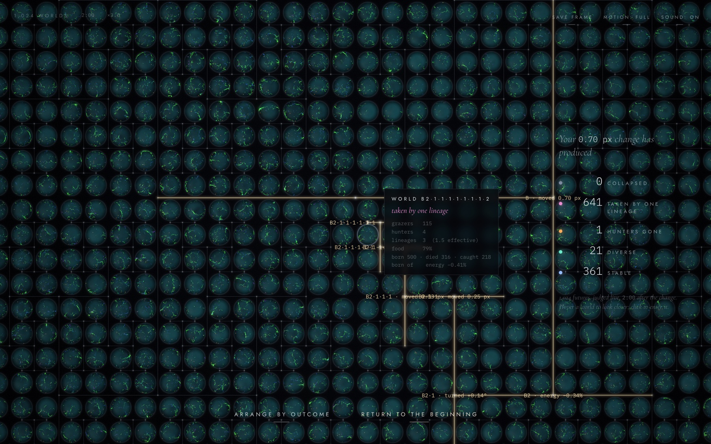
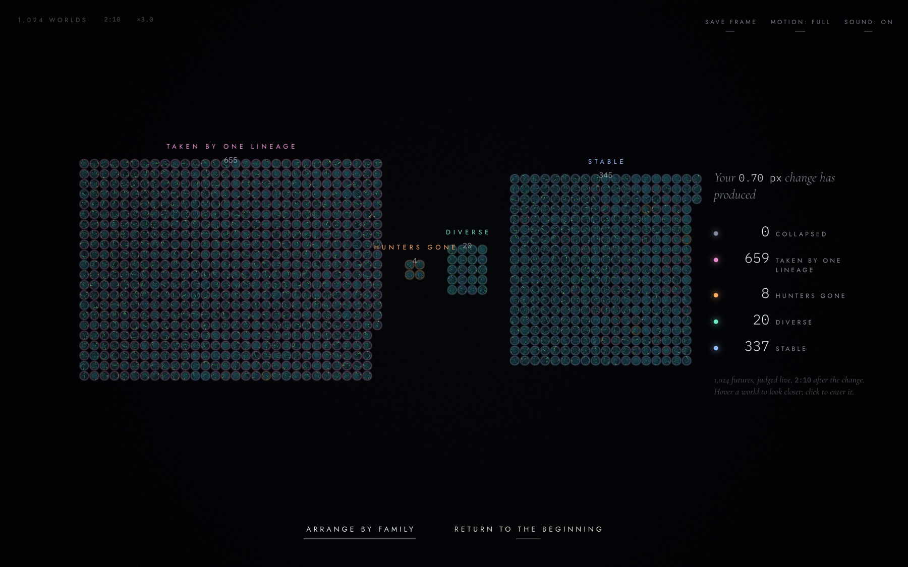
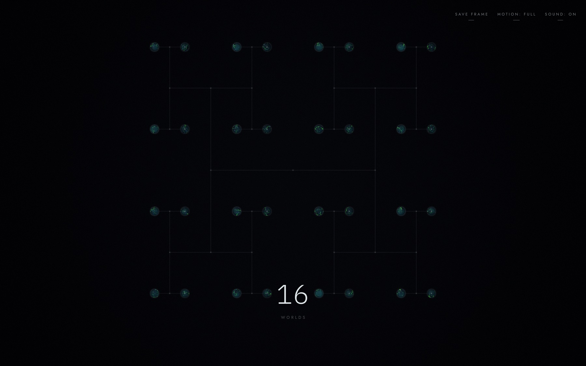
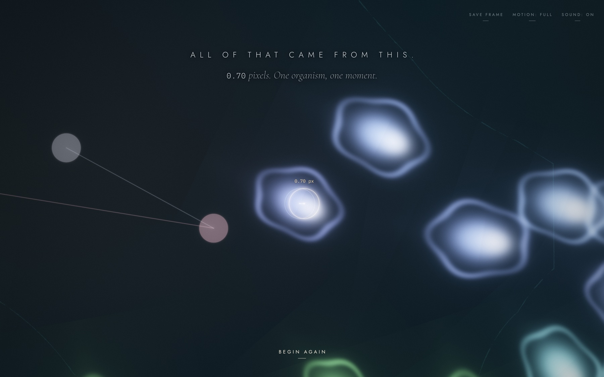

# The Butterfly Machine

*One tiny choice. Hundreds of different worlds.*

An interactive artwork about sensitivity to initial conditions. You watch a small living world, move one organism by a fraction of a pixel, and watch that world split into two, then sixteen, then 1,024 futures. Every one of them is a real, deterministic simulation that traces back to the same origin.

```
npm install
npm run dev        # http://localhost:5173
npm test           # engine tests (determinism, replay, branching, metrics, edge cases)
npm run lint && npm run typecheck && npm run build
```

`?seed=1234` fixes the world. `?debug` (or the <kbd>`</kbd> key) shows the developer overlay.

## What it looks like

All screenshots come from one real run (`?seed=4242`). Every number in them was measured by the simulation at that moment.


*Figure 1. One world. Grazers in six coloured lineages school across a glowing resource landscape. Amber hunters, shaped like rings, chase them. When something dies it leaves a luminous remnant, and the remnants link into faint constellations.*


*Figure 2. Change one thing. Time stops and the camera leans in. Dragging moves the organism only 0.70 px, the gap between the faint ring (where it was) and the bright ring (where it is now).*


*Figure 3. Two futures. World A is untouched and World B carries the 0.70 px change. Seven seconds later they are already 15.2% different. The faint halos mark the organisms that are no longer where their twin is, and you can watch them spread outward from the touched one.*


*Figure 4. The first difference. Both worlds are replayed from the moment of the touch, and the replay stops at the first event that happened differently. Here two organisms touched 1128 ms earlier in World B, 1.93 s after the change. Everything after that followed from it.*


*Figure 5. Sixteen futures. Every world splits again with its own tiny ±δ change. The thin luminous lines are the family tree, drawn as an H-tree: siblings sit side by side, and each pair of siblings joins its cousins one level up.*


*Figure 6. 1,024 futures, all descended from the same 0.70 px touch and all simulated live. The panel on the right counts what has become of them so far. In this run, 595 have been taken over by a single lineage, 400 are stable and 29 are still diverse.*


*Figure 7. How the worlds are related. Hovering over a world lights its ancestry in gold, from the world itself back to the origin. Each fork is labelled with the tiny change made there, e.g. "B2·1 · turned +0.14°" or "B2 · energy −0.34%". The card gives the hovered world's own state: population, lineages, food, births and deaths.*


*Figure 8. Arrange by outcome. The same 1,024 futures, regrouped by what became of them: 659 taken by one lineage, 337 stable, 20 diverse and 8 whose hunters all died. Each world's rim is tinted with its class colour. All of these worlds were identical a couple of minutes earlier.*


*Figure 9. Return to the beginning. The futures fold back into their parents along the tree, from 1,024 to 512 to 256, all the way down to 1.*


*Figure 10. The ending. The original world reappears at the instant it was touched, with the organism shown in both of its positions: where it was, and 0.70 px away.*

## The experience

1. **One world.** A disk-shaped ecosystem, already alive.
2. **Change one thing.** Time slows and stops. One organism is suggested. Drag any organism; the drag is heavily resisted, so a long gesture moves it less than 3 px. Keyboard: arrow keys (0.1 px, or 0.5 px with Shift), then Enter.
3. **Two futures.** World A is untouched; World B carries your change. A measured divergence climbs from about 0.01 %. Organisms that are no longer where their counterpart is get a faint halo, so you can watch the cause spread.
4. **Find the first difference.** Both worlds are replayed from the moment of the touch, with every touch, birth, death and catch recorded. The replay stops at the first event that happened in one world and not the other, then shows it in slow motion (e.g. *"2.32 s after your touch. Two organisms touched 5.1 ms earlier in World B."*).
5. **Branch again → 4 → 8 → 16 → Run 1,000 futures.** The map grows to 1,024 worlds laid out as an H-tree, so relatives sit next to each other. Wheel or pinch zooms, drag pans, clicking a world opens it, Esc / U goes back up the family. Hover shows a world's ancestry and stats. *Arrange by outcome* regroups the futures by what became of them.
6. **Return to the beginning.** The futures fold back into their parents (1,024 → … → 1), and the original world reappears at the moment you touched it: *All of that came from this. 0.70 pixels.*

There is also *Share this future* (a link that rebuilds exactly that universe), *Save frame* (<kbd>P</kbd>, a 2× PNG), sound on/off (<kbd>M</kbd>), and a reduced-motion toggle. Reduced motion follows `prefers-reduced-motion` by default.

## Architecture

There are no frameworks. The stack is TypeScript, Vite, raw WebGL2, Web Workers and Web Audio. The UI is a handful of text elements, so React would add machinery without benefit. Rendering is 2D instanced drawing with custom shaders, where Three.js would mostly get in the way.

| Layer | Files | Notes |
|---|---|---|
| Deterministic randomness & math | `src/sim/hash.ts` | Counter-based hashing for every random choice at run time; `sfc32` only for world creation; `dsin/dcos` built from IEEE-exact operations. |
| State | `src/sim/world.ts` | A world is a struct-of-arrays in **one ArrayBuffer**, so a snapshot is `buffer.slice()`, a branch is a copy, and moving a world between threads is a zero-copy transfer. |
| Stepping | `src/sim/step.ts` | Fixed 1/60 s step. Rules are summarised at the top of the file. Parameters live in `ECOLOGY`. |
| Interventions | `src/sim/interventions.ts` | `nudge`, `turn`, `energy`, targeted by agent id. Machine branches use ±δ of a deterministic tiny change. |
| Events | `src/sim/events.ts` | A small ring of discrete events lives in the state. High-volume touch events are only recorded during replay. |
| Metrics, outcomes, divergence | `src/sim/metrics.ts`, `src/sim/divergence.ts` | Documented below. |
| Replay & first difference | `src/sim/replay.ts` | A future is *described* (origin + `[(step, intervention)]`) and rebuilt by forward replay, never by reversing physics. |
| Workers | `src/engine/worker.ts`, `pool.ts`, `packet.ts` | One worker per core (up to 12) holds the futures, all stepped in lockstep by the main thread's clock. Each frame, each worker returns one packed render buffer, recycled to avoid GC churn. A separate worker runs first-difference searches and replays. |
| Tree | `src/engine/tree.ts` | Heap-indexed binary tree (origin = 1; children of k are 2k, 2k+1). |
| Rendering | `src/render/*` | Instanced organisms with procedural SDF bodies, world disks with a topographic resource field, a screen-space trail buffer reprojected through camera motion, luminous structures, bloom and tone mapping. Level of detail comes from screen size: off-screen worlds send only metrics, small ones send a 16² field, large ones send ids, structures and a 48² field. |
| Experience | `src/experience/director.ts` | The act state machine, camera (van Wijk–Nuij zoom paths), layout (H-tree / outcome clusters), interaction, labels and sound mapping. |
| Sound | `src/audio/sound.ts` | Each lineage owns one tone of a chord, so harmony follows lineage composition. Births ring bells, catches tick, and World A / World B sit left and right in the stereo field. |

**Determinism.** Same seed + same interventions give bit-identical state on every run, independent of frame rate (tests compare raw buffers). Because run-time randomness is a hash of `(seed, step, agent id, purpose)` rather than a shared stream, a difference between two worlds can only spread through interactions.

## Divergence metric

Organism ids are shared by every descendant of the origin (a child's id is a hash of its parent's id and its birth step), so each organism can be matched across worlds:

```
c(id)       = min(1, distance / 36)   if the organism exists in both worlds
            = 1                       if it exists in only one
agentTerm   = mean of c over the union of ids
fieldTerm   = min(1, Σ|fA − fB| / (0.3 · Σ (fA + fB)/2))   resource field, inside the disk
divergence  = 0.85 · agentTerm + 0.15 · fieldTerm
```

Identical worlds score exactly 0. A 0.7 px nudge starts near 0.01 %. Unrelated worlds score close to 100 %. The halos are the per-organism `c` values.

## Outcome classes

Classes are computed live from each world's state. The first matching rule wins:

| Class | Rule |
|---|---|
| collapsed | fewer than 6 grazers |
| taken by one lineage | one lineage ≥ 75 % of grazers |
| hunters gone | no hunters left |
| diverse | inverse Simpson index over lineages ≥ 2.6 |
| stable | otherwise |

The thresholds were chosen by running many perturbed futures headless (`scripts/`). They are descriptive labels for a fictional world, not claims about real ecosystems.

## Honesty

Nothing on screen is staged. Every future is simulated, every percentage is measured, every count is computed, and the first difference comes from replaying real history. The world itself is invented: an artistic system inspired by chaos theory, not a model of reality.
