# The Butterfly Machine

*One tiny choice. Hundreds of different worlds.*

A neuro-inspired interactive artwork about sensitivity to initial conditions. You watch a small recurrent network of light respond to an ambiguous image. You delay one of its spikes by a few milliseconds. The network splits into two, and then into a thousand. Each copy goes on to read the same image in its own way.

The question it asks: *how can one tiny change inside a mind create hundreds of different ways of experiencing the same thing?*

## Try it

**Live:** [butterfly-machine.vercel.app](https://butterfly-machine.vercel.app). Use a recent desktop browser with WebGL2, and turn sound on.

Or run it locally:

```
npm install
npm run dev        # then open http://localhost:5173
```

`?seed=1234` fixes the network (the screenshots below use `?seed=7`). `?debug`, or the <kbd>`</kbd> key, shows the developer overlay.

> This is an artwork, not neuroscience. The network is *neuro-inspired*: it borrows ideas from recurrent neural dynamics, attractor networks and the sensitivity of spiking networks to single spikes. It is not a simulation of a human brain. The interpretations (HOME, LOSS, FEAR …) are names the artwork gives to regions of the network's state space. They are visual metaphors, not claims that the network feels anything.

## How to use it: a walkthrough

All screenshots come from one real run (`?seed=7`). Every number in them was measured by the simulation at that moment. The whole piece takes about five minutes. Apart from one slider and a few buttons, there is nothing to configure.

### 1. Begin

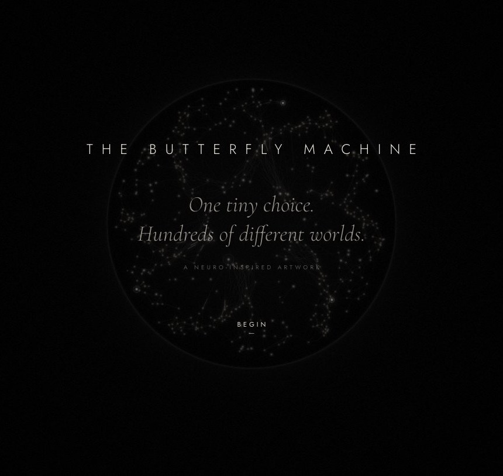

Click **Begin**. Sound starts here, because browsers only allow audio after a click. It can be muted at any time with **Sound** at the top right, or <kbd>M</kbd>.

### 2. Watch one mind

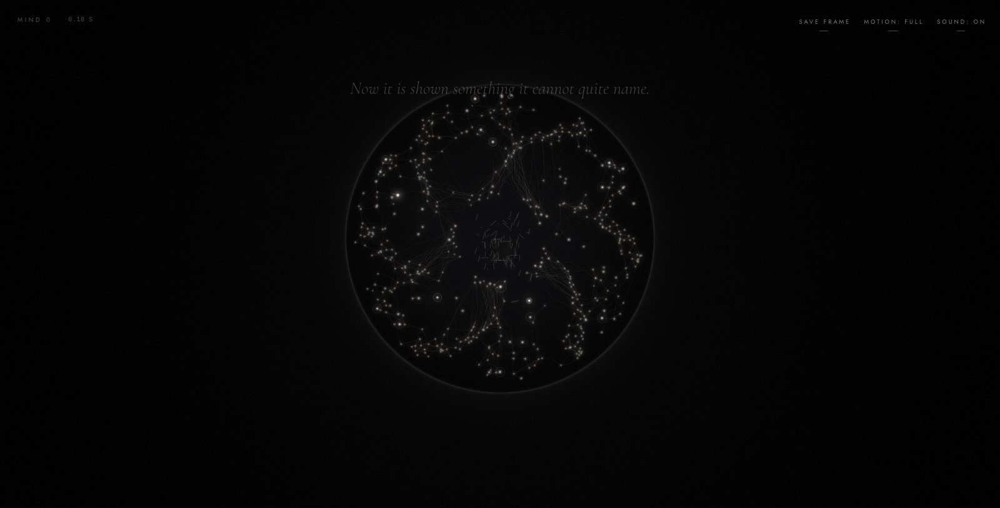

You are looking at one small network: about 500 points of light. The six curving arms are six *assemblies* of excitatory units. A ring of sensory units surrounds the centre, and inhibitory units fill the space between. At rest it only flickers. Then an image fades in at its centre: fragments of a house, rain, a figure, light from a doorway, broken texture. The network starts to respond. Just watch; there is nothing to do yet.

### 3. Change one thing

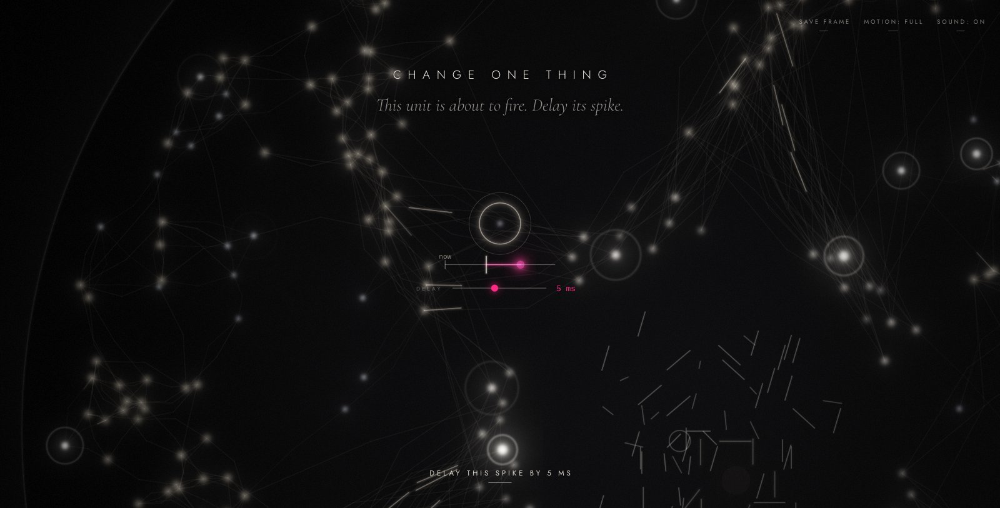

Time slows and stops. **CHANGE ONE THING.** One unit is circled: it is about to fire. Beneath it, a tiny timeline shows *now*, the moment it would fire (cream tick), and the moment it will fire instead (pink).

- Drag the pink **delay** slider, or press <kbd>←</kbd>/<kbd>→</kbd>, to choose 1–10 ms. The default is 5 ms.
- Optionally, click another unit that is about to fire to change that one instead.
- Click **Delay this spike by 5 ms**, or press <kbd>Enter</kbd>.

### 4. Watch two minds come apart

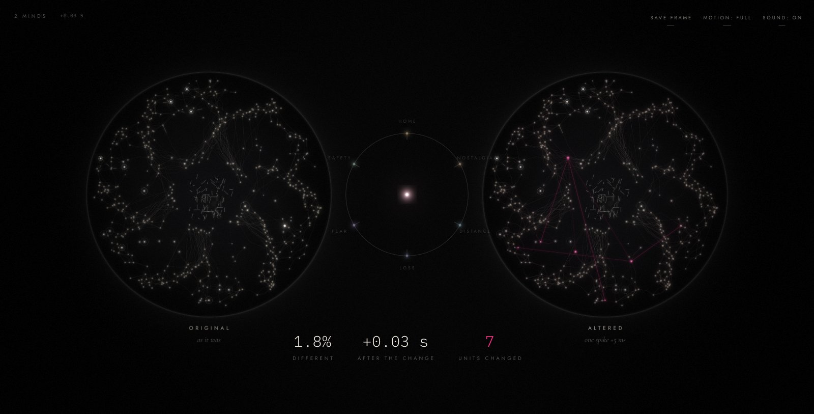

The network becomes two: **ORIGINAL** (as it was) and **ALTERED** (one spike 5 ms late). They start in slow motion. Watch ALTERED: every unit that now fires differently from its twin turns **pink**, and thin pink lines trace each one back to the unit whose changed spike reached it. The numbers count it: *Different* (how far apart the two minds are), *After the change*, and *Units changed*.

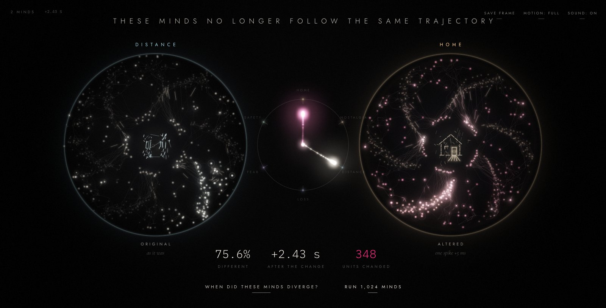

Within a second or two of network time, each mind settles. Its whole picture takes on one reading of the image. Here ORIGINAL became **DISTANCE** (cold, scattered) and ALTERED became **HOME** (the fragments assemble into a lit house and the arms pull together). The compass between them shows the two paths through the space of interpretations: together at first, then apart. When they end up in different places the piece says *these minds no longer follow the same trajectory*. Sometimes they arrive at the same interpretation by different paths, and it says that instead.

Two buttons appear: **When did these minds diverge?** and **Run 1,024 minds**.

### 5. Ask when they diverged

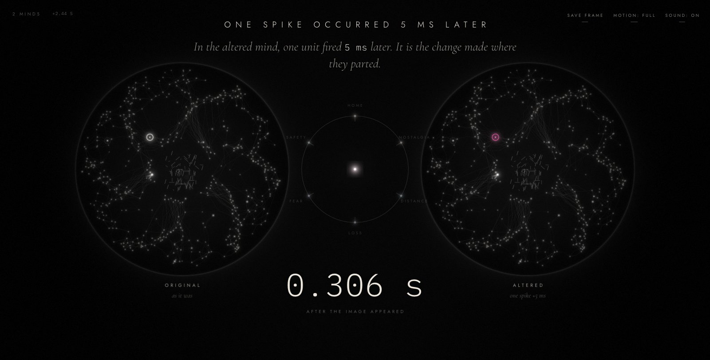

**When did these minds diverge?** rewinds both minds to where they parted and replays them side by side, compared at every millisecond. It stops on the first spike that happened differently (*one spike occurred 5 ms later*, here 0.306 s after the image appeared), circled in both minds.

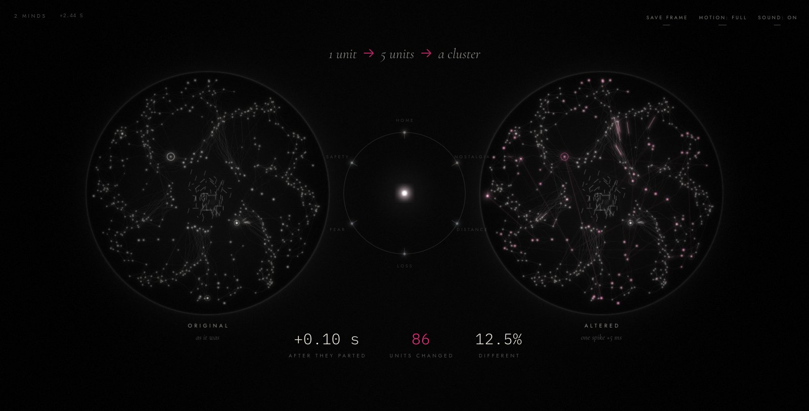

Then it replays the cascade in slow motion, building the chain as it happens: *1 unit → 5 units → a cluster → the whole network → the trajectories split*, and finally the two interpretations. Click **Return to the present** (or press <kbd>Esc</kbd>) when you have seen enough.

### 6. Run 1,024 minds

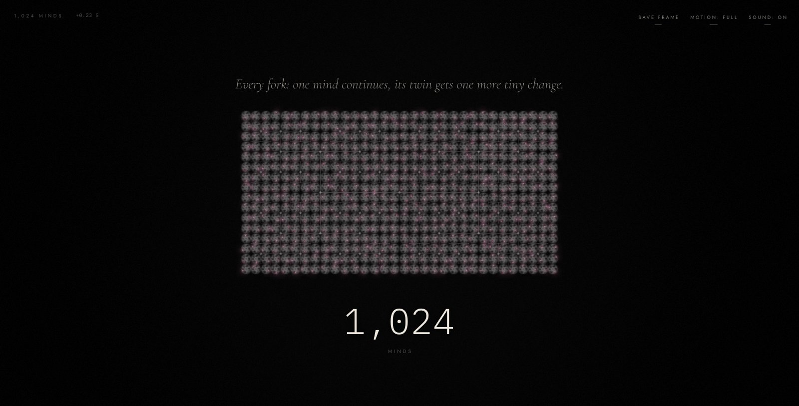

**Run 1,024 minds** (256 on smaller machines) goes back to the moment of the change and forks every 25 ms of network time. At each fork one mind continues and its twin gets one more microscopic change, so there are 4, 8, … and finally 1,024 minds. Each one is a full simulation.

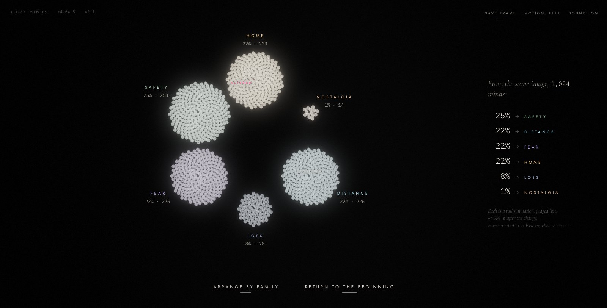

The minds then spread over a landscape and gather by where they settle. Each cluster is labelled with its share, and the panel on the right lists the distribution (*25% → SAFETY …*). Your own two minds are marked **ORIGINAL** and **ALTERED** among them.

- **Scroll** or pinch to zoom, and **drag** to pan. <kbd>Esc</kbd> returns to the whole landscape.
- **Hover** a mind to see its state, its ancestry and the change made at its fork.
- **Click** a mind to enter it. **Arrange by family** shows the branch tree instead.

### 7. Look at one mind, and compare

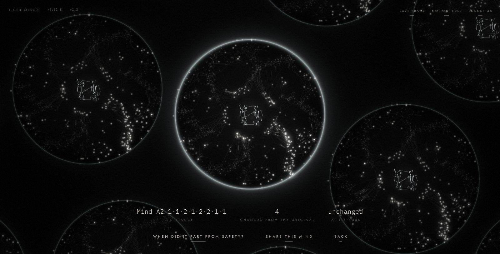

When you click a mind, it opens. Beneath it you see its name, its interpretation, how many tiny changes separate it from the original, and the change made where it was born. From here:

- **When did it part from …?** replays its divergence from its nearest relative that ended up somewhere else.
- Click a second mind first to compare those two instead (*When did these minds diverge?*).
- **Share this mind** copies a link that rebuilds exactly this mind for anyone who opens it.
- **Back** returns to the landscape.

### 8. Return to the beginning

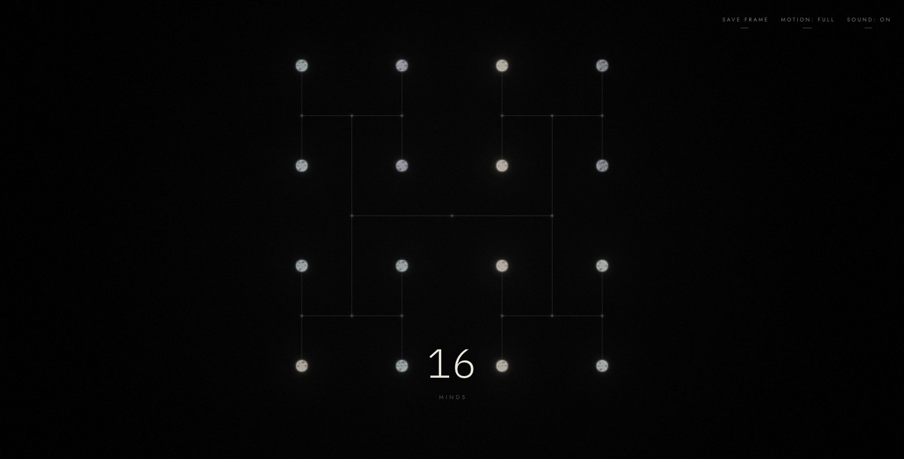

**Return to the beginning** folds the minds back into their parents: 1,024 → 256 → 64 → 16 → 4 → 2 → 1.

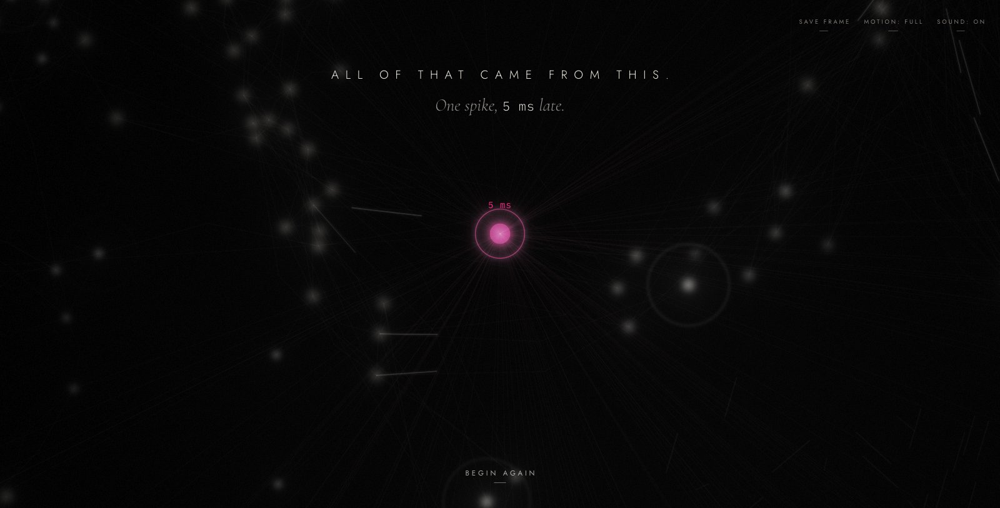

The original network returns at the moment of the change, dimmed. Only one thing is still lit: the hot-pink unit whose spike you delayed. *All of that came from this. One spike, 5 ms late.* Click **Begin again** to start over with a new network.

### Controls

| | |
|---|---|
| <kbd>←</kbd> <kbd>→</kbd> · <kbd>Enter</kbd> | choose the delay · confirm the change |
| Scroll, pinch · drag | zoom · pan the landscape |
| Hover · click | inspect a mind · open it (click a second mind to compare) |
| <kbd>Esc</kbd> / <kbd>U</kbd> | back out of a mind or a replay |
| <kbd>M</kbd> | sound on/off |
| <kbd>P</kbd> | save the current frame as a 2× PNG (also *Save frame*) |
| *Motion* (top right) | reduced motion; follows `prefers-reduced-motion` by default |
| <kbd>`</kbd> | developer overlay |

## Development

```
npm test           # engine tests (determinism, sensitivity, attractors, replay, lineage, …)
npm run lint && npm run typecheck && npm run build
```

## The colour of cause

Ordinary activity is cream, bone, charcoal and grey. **Hot pink is reserved for the change and for what it caused.** Pink is never decorative and never random. It is computed by comparing the altered mind with its control twin after every simulation step, in full precision (see *Pink lineage* below):

| On screen | Meaning |
|---|---|
| hot pink, pulsing | the postponed spike, waiting |
| bright pink flash | a unit whose spike just happened differently, brightest for the earliest generations |
| pink line between two units | the synapse along which that difference arrived |
| faint pink haze | a unit whose state still differs from its twin's |

## The network

| | |
|---|---|
| Units | 500 leaky integrate-and-fire units: 50 sensory (5 channels × 10), 360 excitatory (6 assemblies × 60), 90 inhibitory |
| Time | fixed step, **1 step = 1 ms** of network time; shown at 150 ms per second, slowed or sped up for the story |
| Synapses | ~32,500, fixed in-degree per class, delays 1–9 ms growing with drawn distance |
| Currents | fast excitatory (τ ≈ 4.5 ms), slow excitatory (τ ≈ 80 ms, lets an assembly sustain itself), inhibitory (τ ≈ 5.5 ms, lets one assembly silence the rest) |
| Stimulus | five fragment channels, fading in from 2.6 s, nearly equal in strength; every assembly reads two fragments strongly and one weakly, so all six readings get the same total drive |
| Noise | a hash of (seed, step, unit): **identical in every branch**, so a difference can only spread along synapses |
| Top-down | assemblies feed back to the sensory units of the fragments they read |

The parameters live in `DYNAMICS` (`src/sim/step.ts`) and `WIRING` (`src/sim/network.ts`). They were tuned headless with the scripts in `scripts/` so that the network rests quietly, the stimulus starts a slow competition, a single postponed spike reaches hundreds of units within a few hundred milliseconds, and the competition is decided about 1.1–1.4 s after the change.

### Attractors

An assembly with enough recurrent excitation can keep itself firing while inhibition holds the others down. Each such self-sustaining state is an attractor. A mind is said to be in attractor *k* when

```
rate_k ≥ 14 Hz   and   rate_k ≥ 1.8 · (second-highest assembly rate) + 4 Hz
```

with rates smoothed over 100 ms. Otherwise it is between attractors: **UNKNOWN**. The six names follow from what each assembly reads in the image: HOME (house + doorway), LOSS (figure + rain), FEAR (figure + broken texture), SAFETY (doorway + figure), NOSTALGIA (house + rain), DISTANCE (rain + texture). How each interpretation is *shown* (warmth, coherence, erasure, trembling, echoes, drift, enclosure) is a fixed artistic mapping in `src/experience/interpretation.ts`.

## Divergence metric

```
unitTerm     = Σᵢ |aᵢᴬ − aᵢᴮ| / Σᵢ (aᵢᴬ + aᵢᴮ)          activation traces, τ = 50 ms
membraneTerm = meanᵢ min(1, |vᵢᴬ − vᵢᴮ| / 0.25)
micro        = 0.75 · unitTerm + 0.25 · membraneTerm
macro        = Σₖ |rₖᴬ − rₖᴮ| / Σₖ (rₖᴬ + rₖᴮ)          assembly rates
divergence   = 0.5 · micro + 0.5 · macro                 ∈ [0, 1]
```

Identical minds score exactly 0. One postponed spike starts at a fraction of a percent. Minds whose spikes have decorrelated but which rest in the same attractor score about 25–40%, and minds in different attractors score 70% or more. For a pair being watched, the number on screen is computed by the worker from full-precision state.

## Pink lineage

`src/sim/causal.ts` runs the control and the altered mind in lockstep and compares them after every step. Because noise is shared, a unit's state can differ from its twin's only if one of its inputs differed. A unit's only output is its spikes, so the difference spreads exactly along spikes that happened differently (*mismatches*). When a unit first mismatches, its generation is 1 + the smallest generation among its presynaptic units whose own mismatch came early enough to arrive through that synapse's delay. That unit becomes its cause. The tests check that every pink unit really differs, that nothing identical is pink, and that every generation-*g* unit has a real presynaptic generation-(*g*−1) cause.

## When did these minds diverge?

`findFirstDivergence` (`src/sim/replay.ts`) rebuilds both minds at their split and replays them side by side, comparing full state every step:

1. **first divergence:** the earliest step at which their states differ and keep differing for 250 steps (a difference that heals completely does not count);
2. **the spike behind it:** the first spike that happened differently, when it fired in each mind (giving the *N ms later* in the reveal), and whether that unit was touched by the intervention made at the split;
3. **the cascade:** when 1, 5, 40 and half of all units had changed their behaviour;
4. **the trajectory split:** the first step at which the assembly-level separation exceeds 0.3 and stays above it for 250 steps.

Nothing is estimated: all of it is read off the two replays. The visual replay then runs in the analyst worker with the lineage restored from the search's snapshot.

## Architecture

There are no frameworks. The stack is TypeScript, Vite, raw WebGL2, Web Workers and Web Audio.

| Layer | Files | Notes |
|---|---|---|
| Deterministic randomness & math | `src/sim/hash.ts` | Counter-based hashing at run time, `sfc32` only for construction, `dsin`/`dcos` from IEEE-exact operations. |
| Architecture | `src/sim/network.ts` | Wiring, delays, positions: a pure function of the seed, built once per thread, shared by every mind. |
| State | `src/sim/mind.ts` | A mind is a struct-of-arrays in **one ArrayBuffer** (~70 KB): a snapshot is `buffer.slice()`, a branch is a copy, a transfer is zero-copy. |
| Stepping | `src/sim/step.ts` | Fixed 1 ms step, per-population integration passes, delay-line delivery (~7 µs per step per mind). |
| Interventions | `src/sim/interventions.ts` | `delay` (postpone one spike), `nudge` (membrane), `weight` (one synapse). The machine's forks are mostly spike delays. |
| Metrics, attractors, divergence | `src/sim/metrics.ts`, `step.ts`, `divergence.ts` | Documented above. |
| Lineage & replay | `src/sim/causal.ts`, `src/sim/replay.ts` | A mind is *described* (origin + `[(step, intervention)]`) and rebuilt by forward replay. |
| Workers | `src/engine/worker.ts`, `pool.ts`, `packet.ts` | One worker per core (up to 12) holds the minds, all stepped in lockstep by the main thread's clock. Paired minds are stepped together and compared every step. Packets carry metrics, a 16² or 48² activity/pink field, and per-unit data for large minds. A separate worker runs divergence searches and replays. |
| Tree & layouts | `src/engine/tree.ts`, `src/experience/layout.ts` | Heap-indexed binary tree; H-tree family layout; the landscape (RadViz-style projection of assembly rates, sunflower clusters per attractor). |
| Rendering | `src/render/*` | Instanced units with a static unit texture, mind disks with activity/pink fields and mood, curved filaments with spikes travelling at their real delays, afterglow buffer, bloom, tone mapping that keeps pink in colour when the rest desaturates. |
| Experience | `src/experience/director.ts`, `interpretation.ts` | The acts, camera, interaction, labels, the stimulus drawing and its re-reading by each attractor, sound mapping. |
| Sound | `src/audio/sound.ts` | A chord tone per assembly that collapses onto one tone and its fifth as a mind settles, spikes as tiny transients, a glassy shimmer for pink, ORIGINAL left and ALTERED right. |

**Determinism.** Same seed + same stimulus + same interventions give bit-identical state on every run, independent of frame rate (the tests compare raw buffers).

## Honesty

Nothing on screen is staged. Every mind is simulated, every percentage is measured, every pink unit is a measured difference, every count is computed, and the first divergence comes from replaying real history. Whether *your* two minds end in different interpretations is decided by the simulation. Sometimes they arrive at the same one by different paths, and the artwork says so.
